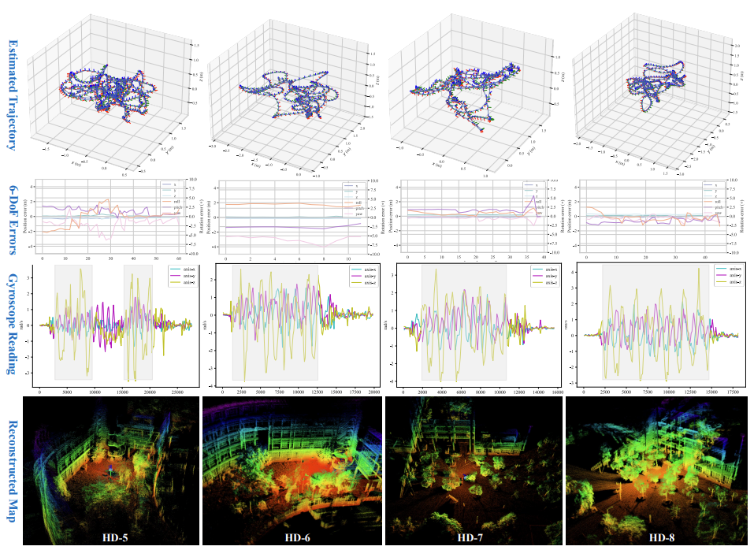

> This repository is the implementation of our paper "Ct-LVI: A Framework Towards Continuous-time Laser-Visual-Inertial Odometry and Mapping". 
>
> A running demo can be found at  https://cslinzhang.github.io/Ct-LVI/Ct-LVI.html

---
### Prerequisites
- Install depends follow the instructions of ["cartographer"](https://google-cartographer.readthedocs.io/en/latest/index.html) and ["cartographer_ros"](https://google-cartographer-ros.readthedocs.io/en/latest/compilation.html) respectively. 

- Build [OpenCV 3.3.1](https://opencv.org/releases/page/2/) (other version may work fine if it includes implementation of SURF keypoint detector) from source with "opencv_contrib"

- Build [GTSAM 4.0.2](https://github.com/borglab/gtsam/tree/4.0.2) with compile options as follows:

  ```cmake -DGTSAM_USE_SYSTEM_EIGEN=ON -DGTSAM_WITH_TBB=OFF -DGTSAM_BUILD_WITH_MARCH_NATIVE=OFF -DGTSAM_COMPILE_OPTIONS_PUBLIC="" ..```

- Build [PCL 1.8.0](https://github.com/peterWon/D-LIOM/blob/master) with compile options as follows:

  ````cmake -DPCL_ENABLE_SSE=OFF ..````
---
### Build
- Clone this repository in your ROS workspace

- Set CMake variable "OpenCV_DIR" in the root [CMakeLists.txt](src/cartographer/CMakeLists.txt) of "cartographer". 

- Return to the root folder of your ROS workspace (which has the same directory as this "README" file) and run:

      catkin_make_isolated
---
### Run an online demo
#### Our HD Dataset
- Some demo sequences can be downloaded via:

  - HD dataset: [link](https://pan.baidu.com/s/1G8JRS38VhW8zwjtxNrXiWw), pwd: bsqi

- Set the file path parameters (TRAJECTORY_BUILDER_3D.lvio_config_filename, POSE_GRAPH.camera_intrinsics_filename, and POSE_GRAPH.dbow_voc_filename) of the config file ([tongji.lua](src/ctlvi/config/tongji.lua)) 

- ```roslaunch ctlvi demo_ctlvi_tongji.launch bag_filename:=BAG_FILE_PATH```
  where BAG_FILE_PATH is the full path of the downloaded bag file in your device

- Some results on the self-collected HD dataset.

  <div align="center">
        
  </div>

  <div align="center">
        
  </div>
#### NTU-VIRAL

- The dataset is available online at [NTU-VIRAL](https://ntu-aris.github.io/ntu_viral_dataset/)

- Set the file path parameters (TRAJECTORY_BUILDER_3D.lvio_config_filename, POSE_GRAPH.camera_intrinsics_filename, and POSE_GRAPH.dbow_voc_filename) of the config file ([viral.lua](src/ctlvi/config/viral.lua))

-     ```roslaunch ctlvi demo_ctlvi_viral.launch bag_filename:=BAG_FILE_PATH```
  where BAG_FILE_PATH is the full path of the downloaded bag file in your device
  
-     Results on VIRAL
  
  <div align="center">
        
  </div>
  
  
#### Your own data
- Write a urdf file of your device and save it to folder ['urdf'](src/dlio/urdf)
- Write a configuration file of your data and save it to ['config'](src/dlio/config)
- Write a launch file of your data and save it to ['launch'](src/dlio/launch)
- Run your bag as above examples
---
### Run offline and view mapping result
#### Launch dlio offline
    roslaunch ctlvi ctlvi_offline_tongji bag_filenames:=BAG_FILE_PATH
#### View mapping result
    roslaunch ctlvi ctlvi_map_viewer_rectified urdf_filename:=tongji pose_graph_pb_filename:=PG_FILENAME range_data_pb_filename:=RD_FILENAME rate:=100
  where PG_FILENAME and RD_FILENAME are binary pbstream files saved to disk when launch the offline script above.

---
### Acknowledgements
- The authors of [cartographer](https://github.com/cartographer-project/cartographer)
- The authors of [cartographer_ros](https://github.com/cartographer-project/cartographer_ros)
- The authors of [LVI-SAM](https://github.com/TixiaoShan/LVI-SAM)
- The authors of [VINS-Mono](https://github.com/HKUST-Aerial-Robotics/VINS-Mono)
- The authors of [CLINS](https://github.com/APRIL-ZJU/clins)

### License
```Following the licenses of the above acknowledged repositories.```
